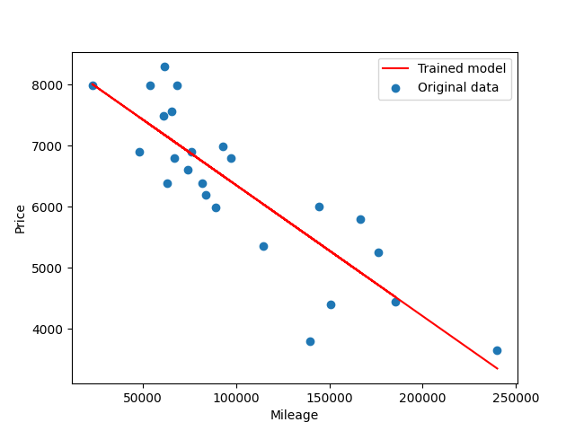

# ft_linear_regression

A program that predicts the price of a car by training a linear function with a gradient descent algorithm.

First run `./train.py`

Now you can estimate price of a car for a given mileage either by running:\
`./estimate.py` and answering the prompt question.

Or by simply passing mileage(s) as argument(s), ex:\
`./estimate.py 73000 24000 120000`